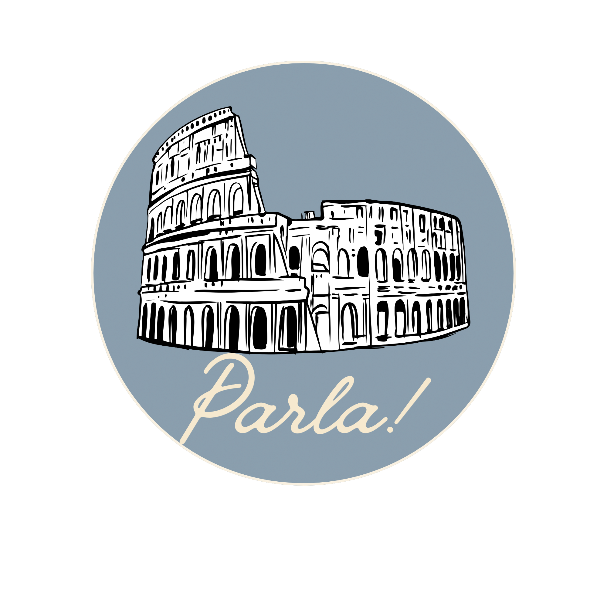
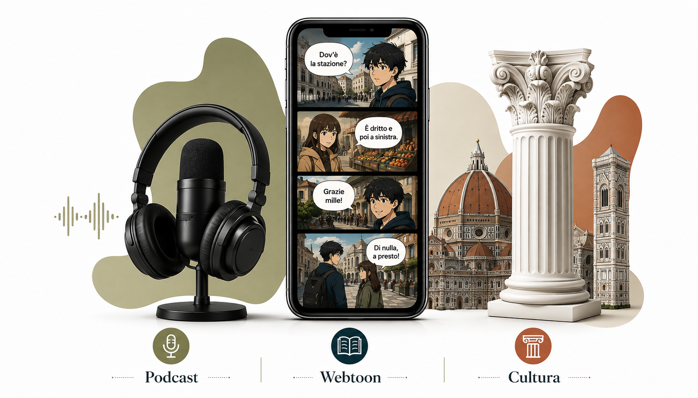

# Guía de componentes — Parla!

## Bloque 1 — Componentes creados

### `.btn`
Botón base. No usar directamente; usar las variantes `.btn-primary` o `.btn-secondary`.

```html
<a href="..." class="btn btn-primary">Texto</a>
<button class="btn btn-secondary">Texto</button>
```

**Variantes:**
- `.btn-primary` — Fondo teal (`--color-primary`), texto blanco.
- `.btn-secondary` — Borde teal, texto teal, fondo transparente.
- `.btn-lg` — Versión grande para hero/CTA.

**Dónde se usa:** `index.html` (hero actions), `login.html`, `registro.html`, header nav.

---

### `.input-field`
Contenedor de campo de formulario con label.

```html
<div class="input-field">
  <label for="email">Correo electrónico</label>
  <input type="email" id="email" name="email" ...>
</div>
```

**Dónde se usa:** `login.html` y `registro.html`.

---

### `.logo`
Enlace con logo + texto, para header y formularios.

```html
<a href="index.html" class="logo">
  
  <span>Parla!</span>
</a>
```

**Dónde se usa:** Header de `src/views/index.html` y `src/views/inicio.html`, encabezado de `src/views/login.html` y `src/views/registro.html`.

---

### `.card`
Tarjeta con borde suave, fondo blanco y sombra.

```html
<div class="card">...</div>
```

**Dónde se usa:** `.feature-card` en landing page, `.auth-card` en login/registro.

---

### `.form-toggle`
Enlace para alternar entre login y registro.

```html
<p class="form-toggle">
  ¿No tienes cuenta? <a href="registro.html">Regístrate aquí</a>
</p>
```

**Dónde se usa:** `login.html` y `registro.html`.

---

### `.auth-form` / `.auth-page` / `.auth-card`
Contenedores para páginas de autenticación (layout centrado vertical y horizontalmente).

**Dónde se usa:** `login.html` y `registro.html`.

---

### `.nav-toggle` + `.nav-links`
Menú de navegación responsive con toggle para móvil. Los `.nav-links` se ocultan
en móvil y se muestran al hacer clic en `.nav-toggle`.

**Dónde se usa:** Header de `index.html` e `inicio.html`.

---

## Bloque 1 (revisión) — Componentes de hero agregados

### `.hero__bg`
Imagen de fondo a plena cobertura dentro del hero. Usa `object-fit: cover` para
cubrir toda la sección sin distorsión. Es decorativa (`alt=""`).

```html

```

**Dónde se usa:** `index.html` — sección hero.

---

### `.hero__logo`
Logo de Parla! posicionado en la esquina superior izquierda del hero, sobre el fondo.
Es una imagen independiente (no un enlace), a diferencia del `.logo` del header.

```html

```

**Dónde se usa:** `index.html` — sección hero.

---

### `.hero__title` / `.hero__title-line1` / `.hero__title-line2`
Título del hero en dos líneas con colores distintos: línea 1 blanca, línea 2 teal
(`--color-primary`). Usa `text-shadow` para legibilidad sobre la foto.

```html
<h1 class="hero__title">
  <span class="hero__title-line1">Aprende</span>
  <span class="hero__title-line2">italiano</span>
</h1>
```

**Dónde se usa:** `index.html` — sección hero.

---

### `.theme-toggle`
Botón flotante en esquina inferior derecha que alterna entre tema claro y oscuro.

```html
<button class="theme-toggle" id="themeToggle" aria-label="Cambiar a tema oscuro">
  <i class="fas fa-moon"></i>
</button>
```

**Comportamiento:**
- `position: fixed` — siempre visible sin importar el scroll.
- Cambia `data-theme="dark"` en `<html>` y guarda la preferencia en `localStorage` (clave `parla-theme`).
- Ícono: `fa-moon` (tema claro activo) / `fa-sun` (tema oscuro activo). Depende de Font Awesome.
- `aria-label` se actualiza dinámicamente según el estado.

**Variables que usa:** `--color-bg-card`, `--color-text`, `--shadow-card-hover`, `--color-primary` (foco).

**JS asociado:** `src/scripts/theme.js` — lógica de alternancia y persistencia.

**Dónde se usa:** Todas las vistas (`index.html`, `login.html`, `registro.html`, `inicio.html`).

---

### `.hero__subtitle`
Subtítulo del hero en Poppins negrita, blanco con `text-shadow`.

```html
<p class="hero__subtitle">De forma real, ligera y entretenida.</p>
```

**Dónde se usa:** `index.html` — sección hero.

---

### `.feature-card` y `.feature-card__link`
Tarjeta de sección en el dashboard de inicio. Es un `<article>` con clase `.card` que contiene un enlace que envuelve todo el contenido.

```html
<article class="feature-card card">
  <a href="#" class="feature-card__link">
    <div class="icon podcast"><i class="fas fa-headphones"></i></div>
    <h3>Podcast</h3>
    <p>Episodios con transcripción para mejorar tu comprensión auditiva.</p>
  </a>
</article>
```

**Tokens de color para cada círculo `.icon`:**

| Tarjeta | Clase CSS | Token de color |
|---|---|---|
| Lecciones en video | `.video` | `--color-primary` |
| Podcast | `.podcast` | `--color-accent-olive` |
| Webtoon | `.webtoon` | `--color-accent` |
| Cultura | `.culture` | `--color-secondary` |
| Flashcards | `.flashcards` | `--color-accent-gold` |
| Quizzes | `.quizzes` | `--color-secondary-dark` |

**Ancho máximo:** `--feature-card-max-w: 280px` (definido en `variables.css`). El grid usa `auto-fit, minmax(240px, var(--feature-card-max-w))` para que las tarjetas sean angostas, centradas, y se adapten a 3 columnas en escritorio, 2 en tablet y 1 en móvil sin media queries.

**Retroalimentación hover:** Las tarjetas no tienen subrayado. Al pasar el mouse, se muestra un borde `box-shadow: 0 0 0 2px var(--color-primary)` y la tarjeta eleva su sombra (`.card:hover`).

**Dónde se usa:** `inicio.html` — dashboard grid.

---

### `.card--featured`
Modificador que agrega un halo de blur pulsante alrededor de una tarjeta. Se usa exclusivamente en la tarjeta de **Lecciones en video** para marcarla como tarea principal/sugerida.

```html
<article class="feature-card card card--featured">
```

**Comportamiento:**
- `box-shadow` con `rgba(var(--color-primary-rgb), ...)` pulsa suavemente entre 14px y 30px de desenfoque con la animación `respirar-halo` (3s ciclo), sin pseudo-elemento.
- `z-index: 1` en la tarjeta (menor que `z-index: 2` de las tarjetas normales) asegura que el halo nunca se superponga a tarjetas vecinas.
- Respeta `prefers-reduced-motion`: si el usuario tiene reducción de movimiento activada, la animación se detiene y queda un halo fijo de 14px.

**Variable de color:** `--color-primary` y `--color-primary-rgb` (teal del proyecto).

**Dónde se usa:** Solo en `inicio.html` — tarjeta de Lecciones en video.

---

### `.composite-section`
Sección de dos columnas debajo del hero en la Landing Page. Muestra un título en la columna izquierda y una imagen compuesta + íconos + párrafo en la columna derecha.

```html
<section class="composite-section animate-in" aria-label="Sección compuesto">
  <div class="composite-section__inner">
    <div class="composite-section__left">
      <h2 class="composite-section__heading">Olvídate de memorizar reglas.</h2>
    </div>
    <div class="composite-section__right">
      
      <div class="composite-section__icons">
        <!-- 3 feature-card con íconos Podcast, Webtoon, Cultura -->
      </div>
      <p class="composite-section__paragraph">...</p>
    </div>
  </div>
</section>
```

**Comportamiento:**
- Grid de 2 columnas en escritorio (`1fr 1fr`), se apila a 1 columna en móvil (≤768px).
- El título usa `--color-heading-gold`, Fraunces 38px, letter-spacing -0.5px, line-height 1.1.
- La columna izquierda tiene `position: sticky` para que el título permanezca visible al hacer scroll (solo escritorio).
- Los íconos (Podcast, Webtoon, Cultura) se muestran en fila con `flex-wrap: wrap` y se apilan en móvil.

**Tokens usados:** `--color-heading-gold`, `--fs-heading-composite`, `--ls-heading-composite`, `--lh-heading-composite`, `--color-text-navy`, `--fs-body-composite`, `--lh-body-composite`.

**Dónde se usa:** Solo en `index.html` — sección compuesto debajo del hero.

---

### `.animate-in`
Sistema de animación de entrada tipo "flotar": el elemento empieza desplazado 24px hacia abajo y opaco, y al entrar en pantalla se desliza a su posición final mientras se hace visible.

**Cómo funciona:**
- El CSS define `opacity: 0` y `transform: translateY(24px)` por defecto.
- Al cargar la página, `animations.js` agrega `js-animations-ready` al `<body>`.
- `IntersectionObserver` detecta cuándo cada `.animate-in` entra en el viewport (threshold 0.15) y agrega `.is-visible`, activando la transición a opacidad 1 y posición original.
- Sin JS (fallback), `body:not(.js-animations-ready) .animate-in` lo deja todo visible desde el inicio.
- Efecto cascada: cada elemento recibe un `transitionDelay` incremental (index % 6 × 80ms) para que aparezcan en secuencia.
- Respeta `prefers-reduced-motion`: sin transición ni desplazamiento.

**JS asociado:** `src/scripts/animations.js` — IntersectionObserver y asignación de delay.

**Dónde se usa:** Todas las vistas (`index.html`, `login.html`, `registro.html`, `inicio.html`, `video.html`, `podcast.html`, `webtoon.html`, `cultura.html`, `flashcards.html`, `quizzes.html`). Aplicado a secciones principales, tarjetas y bloques de contenido.
